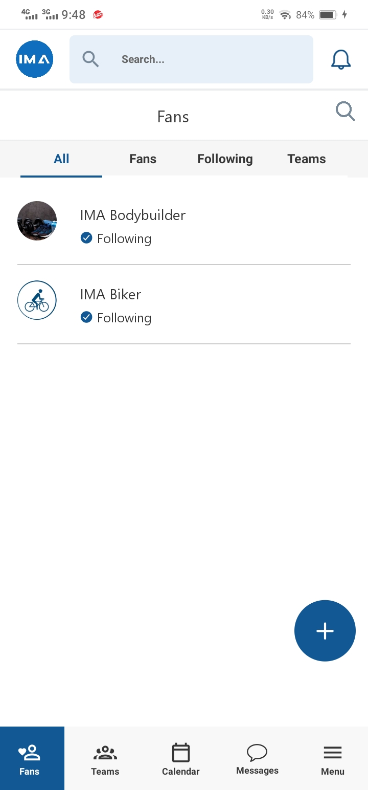

# 👋 Hi, I'm Ahmad Shahzad

### 🚀 React Native & React JS Developer

Welcome to my GitHub profile! I am a passionate and dedicated developer specializing in building modern, responsive, and high-performance applications using React Native and React JS. 

---

## 🛠️ Technologies & Tools

- **Frontend:** 
  - React JS
  - React Native
  - Redux / Context API
  - JavaScript (ES6+)
  - HTML5 & CSS3
  - TypeScript

- **Mobile Development:**
  - React Native
  - Expo
  - Native Modules

- **Tools & Platforms:**
  - Git & GitHub
  - VS Code
  - Firebase

---

## 🌟 Featured Projects

### Project 1: React Native App
A high-performance mobile application built with React Native, providing seamless user experience and rich features.

- **Tech Stack:** React Native, Redux, Firebase
- **Features:** Authentication, Realtime Database, Push Notifications

 

### Project 2: React JS Web App
Contributed to booking module of a modern and responsive web application developed using React JS, showcasing a clean and intuitive user interface.

- **Tech Stack:** React JS, Context API, Node.js
- **Features:** Online booking

### Project 3: Todolist Applicaton with advanced features
An end-to-end solution with both frontend and backend components, demonstrating my full-stack development capabilities.

- **Tech Stack:** React JS, Node.js, Express.js, MongoDB
- **Features:** CRUD Operations, Responsive Design

---

## 📫 Let's Connect

- **Email:** [ahmad.shahzad1416@gmail.com](mailto:ahmad.shahzad1416@gmail.com)
- **LinkedIn:** [[linkedin.com/in/ahmad-shahzad-20](https://www.linkedin.com/in/ahmad-shahzad-20/)]

Feel free to reach out if you have any questions or would like to collaborate on a project!

---
Thanks for visiting my GitHub profile! 🚀
